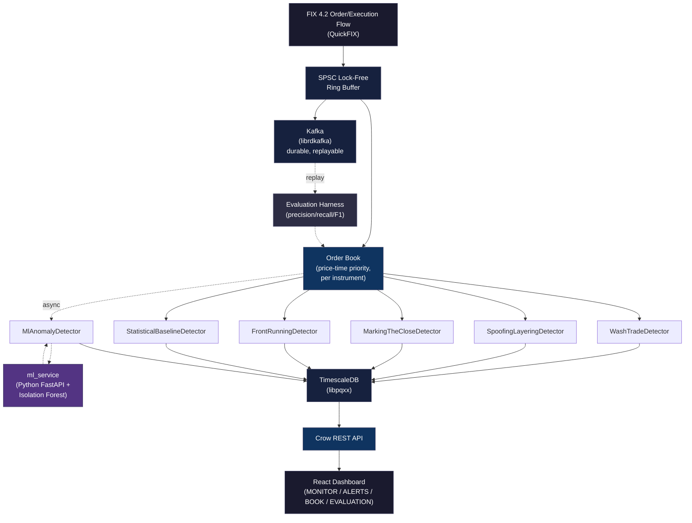

# Multi-Asset Trade Surveillance Engine

A post-trade market abuse detection system that ingests live FIX 4.2 order and execution flow, maintains a real-time price-time-priority order book per instrument, and runs six independent detection modules — five deterministic rule-based detectors plus one unsupervised ML anomaly detector — against that live state. Alerts persist to TimescaleDB with full evidence and are surfaced through a REST API and a React compliance dashboard. It exists to answer a concrete question for market-abuse surveillance: given real order-level FIX flow, which detection strategies actually catch which patterns, at what precision/recall tradeoff, measured against labeled synthetic data and validated against a real, publicly documented enforcement case (CFTC v. Sarao).

## Architecture



```
FIX 4.2 flow (QuickFIX)
      │
      ▼
SPSC lock-free ring buffer  ──▶  Kafka (librdkafka, durable/replayable log)
      │
      ▼
Order book (price-time priority, per instrument)
      │
      ├──▶ 5 rule-based detectors (inline, synchronous, hot path)
      │
      └──▶ MlAnomalyDetector ──▶ ml_service (Python FastAPI + scikit-learn
                                   Isolation Forest) — async, off the hot path
      │
      ▼
TimescaleDB (libpqxx) ──▶ Crow REST API ──▶ React dashboard
```

- **C++17**, two build configurations: an optimized release build and an ASan/TSan-instrumented debug build.
- **QuickFIX** for FIX 4.2 session management and message parsing (`NewOrderSingle`, `ExecutionReport`, `OrderCancelRequest`). Order/execution events flow through ingestion, the order book, and every detector as the FIX-derived structs themselves — no separate internal event format.
- A hand-rolled **SPSC lock-free ring buffer** is the hot-path ingestion queue; **librdkafka** sits behind it as the durable, replayable log that makes deterministic replay (used by both the evaluation harness and the Sarao validation) possible.
- The order book, detectors, and the live-vs-replay wiring are the same code path in both live and replay mode — the evaluation harness never runs a separate offline scorer.
- **TimescaleDB** (hypertables for orders/trades/alerts) via **libpqxx**.
- **Crow** REST API; **React** dashboard (dark, dense, monospace terminal-style UI).

## Detection modules

| Detector | What it catches |
|---|---|
| `WashTradeDetector` | Both sides of an execution matched to the same beneficial owner, an explicit linked-account relationship, or a literal self-trade. |
| `SpoofingLayeringDetector` | Orders placed deep in the visible book and cancelled shortly after, correlated with a favorable price move and same-side order concurrency elevated above the instrument's own recent baseline. |
| `MarkingTheCloseDetector` | A linked account group whose combined volume disproportionately dominates the window immediately before session close. |
| `FrontRunningDetector` | A related account's order placed immediately ahead of a large same-side order from another related account. |
| `StatisticalBaselineDetector` | A z-score control against each account/instrument's own running order-size baseline — deliberately naive, kept as the evaluation harness's comparison point for what the pattern-aware detectors add over a simple statistical control. |
| `MlAnomalyDetector` | An Isolation Forest (scikit-learn) scoring account/instrument order-flow windows (order count, quantity, cancel ratio, arrival rate) for unsupervised anomalies — entirely asynchronous, never on the hot path. |

## Evaluation results

Measured by replaying labeled synthetic scenarios (10 synthetic minutes, 210 accounts, 15 instruments across equity/FX/fixed-income, 15 injected scenarios per abuse pattern) through Kafka into the real live pipeline — not a separate offline scorer. Full detail, threshold sweeps, and per-detector findings in `cpp/harness/README.md`.

| Detector | Target pattern | Threshold | Precision | Recall | F1 |
|---|---|---|---|---|---|
| `WashTradeDetector` | WashTrade | 0.5 | 1.000 | 1.000 | 1.000 |
| `FrontRunningDetector` | FrontRunning | 0.5 | 0.610 | 0.556 | 0.581 |
| `MlAnomalyDetector` | any injected abuse | 0.7 | 1.000 | 0.186 | 0.314 |
| `MarkingTheCloseDetector` | MarkingTheClose | 0.4 | 0.138 | 0.514 | 0.218 |
| `StatisticalBaselineDetector` | any injected abuse | 0.5 | 0.024 | 0.626 | 0.046 |
| `SpoofingLayeringDetector` | SpoofingLayering | 0.5 | 0.016 | 0.053 | 0.024 |

Honest framing, not cherry-picked: `WashTradeDetector` is a deterministic, unambiguous rule and performs like one. `FrontRunningDetector` and `MlAnomalyDetector` trade recall for precision at their chosen operating points. `SpoofingLayeringDetector` and `StatisticalBaselineDetector` show real, disclosed precision/recall weaknesses at this scale and threshold — both are density-sensitive in ways documented in `cpp/harness/README.md` rather than tuned away. `MarkingTheCloseDetector`'s recall is capped in part by an intentional per-(instrument, account-group) lifetime dedup, not purely a detection miss.

## Real-world validation: CFTC v. Sarao

The 2010 Flash Crash "Layering Algorithm" pattern from *CFTC v. Nav Sarao Futures Limited PLC & Navinder Singh Sarao* (Docket No. 1:15-cv-03398, N.D. Ill., filed 2015-04-21; primary source: CFTC Press Release 7156-15) is reconstructed as a fixed, documented, cited FIX order sequence — not randomized — and replayed through the full live pipeline via the same Kafka-replay machinery the evaluation harness uses. Every quantitative detail (order count and spacing, cancellation behavior, cycling pattern) is cited directly to the press release; see `cpp/simulator/abuse/sarao_case.hpp`.

**Result: `SpoofingLayeringDetector` fired on 25 of 25 layered sell orders, max score 0.7611, comfortably clear of the 0.6 alert threshold, zero missed.**

This is the one deliberate exception to this project's synthetic-only data policy: public regulatory record, safe to construct and commit directly, unlike the licensed WRDS/TAQ data below.

## Data calibration (WRDS/TAQ)

The synthetic order-flow generator's baseline parameters are calibrated against real market microstructure statistics pulled from WRDS Daily TAQ (trade-and-quote data) for a 10-symbol equity basket (AAPL, DE, EBAY, GILD, HAS, JPM, MSFT, RF, TGT, XOM):

- **Trade size distribution**: p50 = 20 shares, p90 = 100, p99 = 448, mean = 51.5, over 1.4M+ trades.
- **Bid-ask spread**: p50 = 3 ticks, p90 = 7 ticks, mean = 4.06 ticks.
- **Order arrival rate proxy**: 16.69 orders/sec/instrument — used directly as `kEmpiricalOrderArrivalRatePerInstrumentPerSecond` in `cpp/simulator/simulator.hpp`.
- **Cancellation-rate proxy** (quote-to-trade ratio — standard TAQ has no order-level cancel messages, so this is a documented proxy, not a direct pull): mean 1.46, used to sanity-check the generator's cancel rate, not to replace it directly.

**Compliance note**: raw and derived TAQ data are never committed to this repository, in any form, at any path — structurally enforced via `calibration/.gitignore` (verified: `trades.csv`/`quotes.csv` are gitignored and untracked; only the derived aggregate statistics in `calibration/output/stylized_facts.json` — percentiles and means, no underlying rows — are committed).

## Testing & correctness discipline

- 325 tests total: 303 C++ (GoogleTest) + 22 Python (pytest), covering ingestion, the order book, all six detectors, the live pipeline, the DB layer, the API, and the evaluation harness.
- 303/303 C++ tests pass clean across all three build configurations: the optimized release build, AddressSanitizer, and ThreadSanitizer — run and verified separately, zero sanitizer-detected issues. Any concurrency-touching code (the SPSC ring buffer, the live pipeline's consumer thread, the DB connection's cross-thread access) is required to pass under ThreadSanitizer specifically, not just ASan.
- The order book and the spoofing/layering detector — the two highest-scrutiny pieces of this project — carry the deepest test coverage, including hand-verified edge cases (same price/time priority, partial fills, cancel-after-partial-fill).

## Setup and running locally

**Prerequisites**: CMake, a C++17 compiler, Docker, Python 3.9+, Node.js.

```bash
# 1. Infrastructure
docker compose up -d          # TimescaleDB + Kafka

# 2. C++ build (two configs)
cmake -B build-bench -DCMAKE_BUILD_TYPE=Release
cmake --build build-bench

cmake -B build-debug -DCMAKE_BUILD_TYPE=Debug -DENABLE_SANITIZERS=ON
cmake --build build-debug

# 3. ML microservice
cd ml_service
python3 -m venv .venv && source .venv/bin/activate
pip install -r requirements.txt
uvicorn app.main:app --host 127.0.0.1 --port 8000

# 4. Dashboard
cd dashboard
npm install
npm run dev                   # http://localhost:5173

# 5. Run the live demo server (separate terminal)
./build-bench/cpp/api/tse_api_server
```

Run the test suite: `ctest --test-dir build-bench` (or `build-debug` for the sanitizer-instrumented run). Regenerate the evaluation harness numbers: `./build-bench/cpp/harness/tse_harness_eval --json cpp/harness/results/evaluation.json` (requires Kafka and `ml_service` running).
